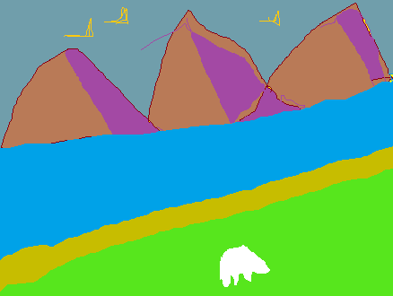

<!--
**Sri417666/Sri417666** is a ✨ _special_ ✨ repository because its `README-sriv.md` (this file) appears on your GitHub profile.-->



Here are some ideas to get you started:

- 🔭 I’m currently working on ...
- 🌱 I’m currently learning ...
- 👯 I’m looking to collaborate on ...
- 🤔 I’m looking for help with ...
- 💬 Ask me about ...
- 📫 How to reach me: ...
- 😄 Pronouns: ...
- ⚡ Fun fact: ...-

---

# My Hobbies

| Rank | Hobbies |
| ---- | ------- |
| 1 | Gardening |
| 2 | Walking |
| 3 | Travel |
| 4 | Bird watch |

<!-- See also <a href="more-hobby">More hobby</a> -->

---

## Quotes

> If we pull together and commit ourselves, then we can push through anything.

— Mona the Octocat

---

<!-- taken this quote from the QSG -->

---

## Links

To create a link, wrap hypertext in [] and the hyperlink in ().

This site was built using [GitHub Pages](https://pages.github.com/).

---

### Section Links

> [Links and section links](#links)
>
<!-- #### Using Anchors

> My hobbies also include
<a name="more-hobby"> watching cookery shows</a>. -->

<!-- Commented because it says Inline-HTML and does not allos.> -->

# Text Styles

- Press Ctrl+b for **bold** text.
- ***Italics*** text  
- **bold** one more example
- ***Italics*** ~~more example~~
- **Conclusion**: embed text in ** for Bold and in *** for italics.
- **Keep the ***goals*** clear.**
- Symbol for **Oxygen** is O<sub>2</sub>
- Formula for **Compound interest** is $$
A = P*(1+r/n)^(nt)$$
- $E=MC<sup>2</sup> $ is the most famous formula in **Physics**. This equation was derived by Albert Einstein around the theory of mass-energy equivalence.
- Use 'git status' to list all new or modified files that are yet to be committed.

---

## Codes and Code blocks

Use triple backticks ``` to distinguish code block

Some basic Git commands are:

```
git status
git add
git commit
```

---

### One more example

To syntax highlight Ruby code:

```ruby
require 'redcarpet'
markdown = Redcarpet.new("Hello World!")
puts markdown.to_html
```

---

### Color Models

The background color is `#ffffff` for light mode and `#000000` for dark mode.

> [!NOTE]
> A supported color model cannot have any leading or trailing spaces within the backticks.
---
> [!WARNING]
> This is how you write a warning.

> A warning can have multiple paragrabhs.
---
> [!CALLOUT]
>
> **This is how you write a callout.**
>
> It can have multiple paragraphs.

---

## Note containing a code block

See how a note with a codeblock renders:

> [!NOTE]
> A note can contain code blocks. For example:
>
> ```js
> const s = "I'm in a code block";
> ```
>
> and so on.

---

## Lists

### Unordered lists

You can make unordered lists with a preceding -, *, or + characters.

- Day 1
- Day 2
- so on.

More sample:

+ Monday

+ Tuesday

One more:

* September

* October

[!NOTE]

- The bullets look same for any of these 3 characters.
- Eventhough a warning message prompts use of - symbol, the other 2 characters * and + create a UL.
- While other special characters do not.

---

### Ordered lists

Precede items with number to get OL.

1. Commerce Hub
2. Tap to Pay
3. more

One more scenario:

7. Other products
10. In finance domain
18. more

[!NOTE]
You can number the list with some numbers. But numbering within a list follows sequence.

### Nested List

1. Example 1 of nested list 
    - Level 2
        - Level 3

#### Dedenting NL

1. Example 1 of nested list 
- Level 2
- Level 3

[!NOTE]

Used Shift + Tab key to dedent.

